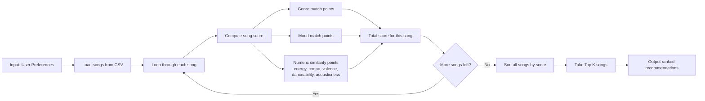
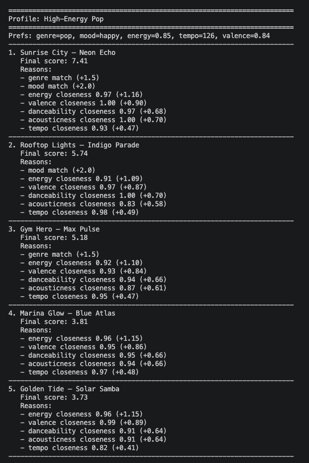
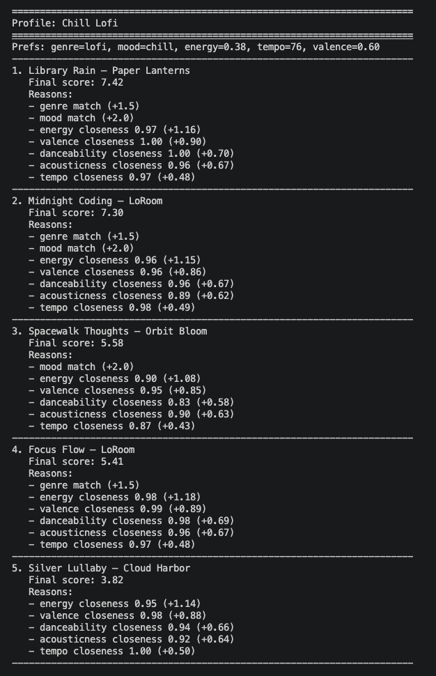
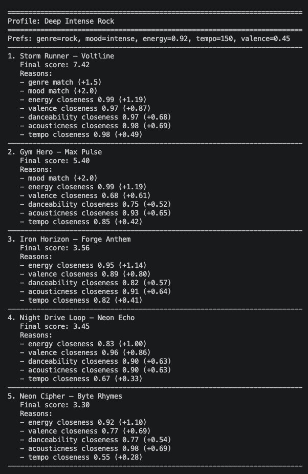
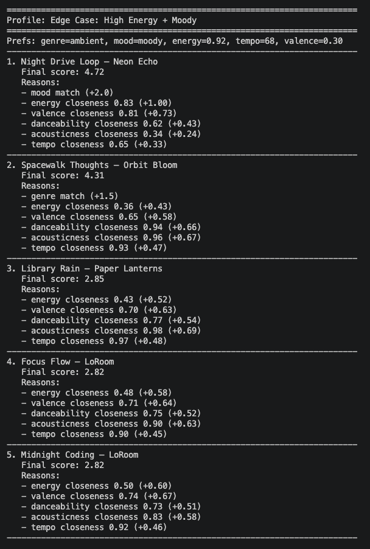
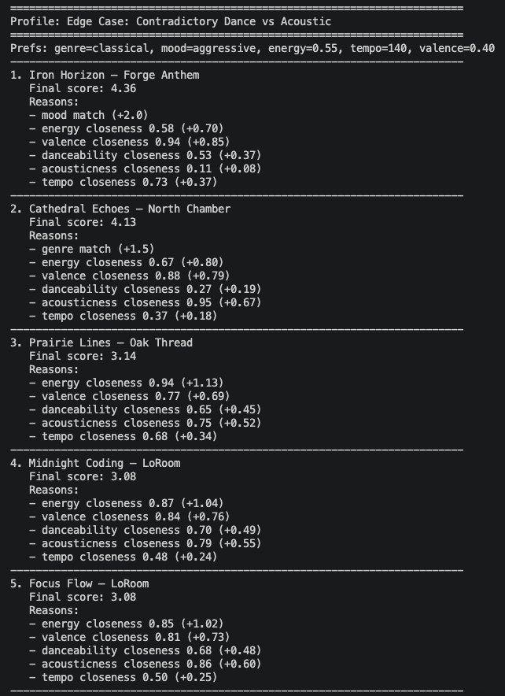

# 🎵 Music Recommender Simulation

## Project Summary

This project builds a small music recommender that scores songs by vibe.
It uses song features like genre, mood, energy, tempo, valence, danceability, and acousticness.
The goal is to show how simple rules can turn data into recommendations.

---

## How The System Works

Real recommender systems usually do two steps.
First they find a candidate set.
Then they rank those items using user behavior and item features.
My version is a small and transparent version of that idea.
It ranks songs by how close they are to a user's taste profile.

The song features in this system are `id`, `title`, `artist`, `genre`, `mood`, `energy`, `tempo_bpm`, `valence`, `danceability`, and `acousticness`.
The user profile stores `favorite_genre`, `favorite_mood`, `target_energy`, `target_tempo_bpm`, `target_valence`, `target_danceability`, `target_acousticness`, and `likes_acoustic`.
The recommender gives points for exact genre and mood matches.
It also gives points when the numeric features are close to the user's targets.
The final score is the sum of those points.
The songs with the highest scores are returned first.

### Finalized Algorithm Recipe

For each song, the recommender computes a total score and then ranks songs from highest to lowest.

1. Start score at `0.0`.
2. Add categorical match points:
  - `+1.5` if `song.genre == user.favorite_genre`
  - `+2.0` if `song.mood == user.favorite_mood`
3. Add numeric similarity points:
  - `energy_similarity = 1 - abs(song.energy - user.target_energy)`
  - `valence_similarity = 1 - abs(song.valence - user.target_valence)`
  - `danceability_similarity = 1 - abs(song.danceability - user.target_danceability)`
  - `acousticness_similarity = 1 - abs(song.acousticness - user.target_acousticness)`
  - `tempo_similarity = 1 - (abs(song.tempo_bpm - user.target_tempo_bpm) / 120)`
4. Apply numeric weights and add to score:
  - `+1.2 * energy_similarity`
  - `+0.9 * valence_similarity`
  - `+0.7 * danceability_similarity`
  - `+0.7 * acousticness_similarity`
  - `+0.5 * tempo_similarity`
5. Store `(song, score, explanation)` for every song.
6. Sort all songs by score descending and return top `k` recommendations.

### Potential Biases To Watch

- The system can over-prioritize mood and genre labels.
- It may keep recommending songs that are very similar to each other.
- A small catalog can create a filter bubble.
- The hand-picked weights reflect human assumptions about what counts as a good vibe.

### Recommendation Flowchart



---

## Getting Started

### Setup

1. Create a virtual environment if you want one.

   ```bash
   python -m venv .venv
   source .venv/bin/activate
   ```

2. Install dependencies.

   ```bash
   pip install -r requirements.txt
   ```

3. Run the app.

   ```bash
   python -m src.main
   ```

### Running Tests

Run the starter tests with:

```bash
pytest
```

You can add more tests in `tests/test_recommender.py`.

---

## Experiments You Tried

### Terminal Output Screenshots

I ran the recommender with five profiles and saved screenshots in the `docs` folder.







The normal profiles looked correct.
The edge cases were useful because they showed how the model handles conflicting preferences.
The same songs did not always rank first, which means the weights are not completely dominated by one feature.

---

## Limitations and Risks

The catalog is small, so some songs repeat near the top.
The model can still lean too hard on mood and genre.
It ignores `likes_acoustic`, so one stored preference is not used yet.
The system can also miss songs that feel right but do not match the labels closely.

---

## Reflection

Read and complete `model_card.md`:

[**Model Card**](model_card.md)

I learned that recommender systems can look smart even when they are using simple math.
The biggest learning moment was seeing how a small change in weights could move songs up or down fast.
AI tools helped me move faster, but I still had to double-check the results when the rankings looked too similar or too confident.
I was surprised that basic rules can still feel like real recommendations when the features line up well.
If I kept going, I would add more songs, use the acoustic preference in scoring, and try a diversity rule so the top results do not feel repetitive.
